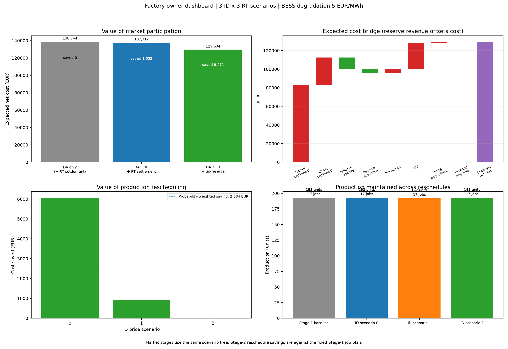
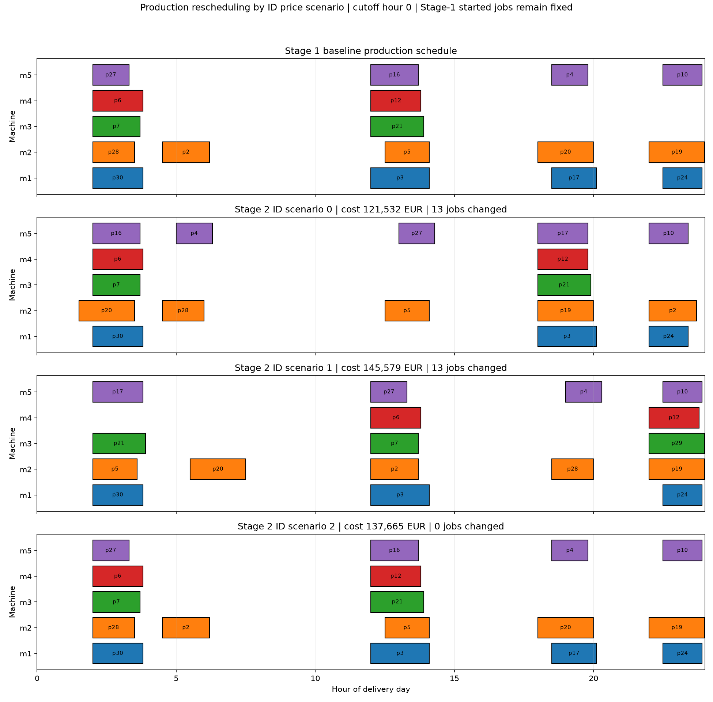
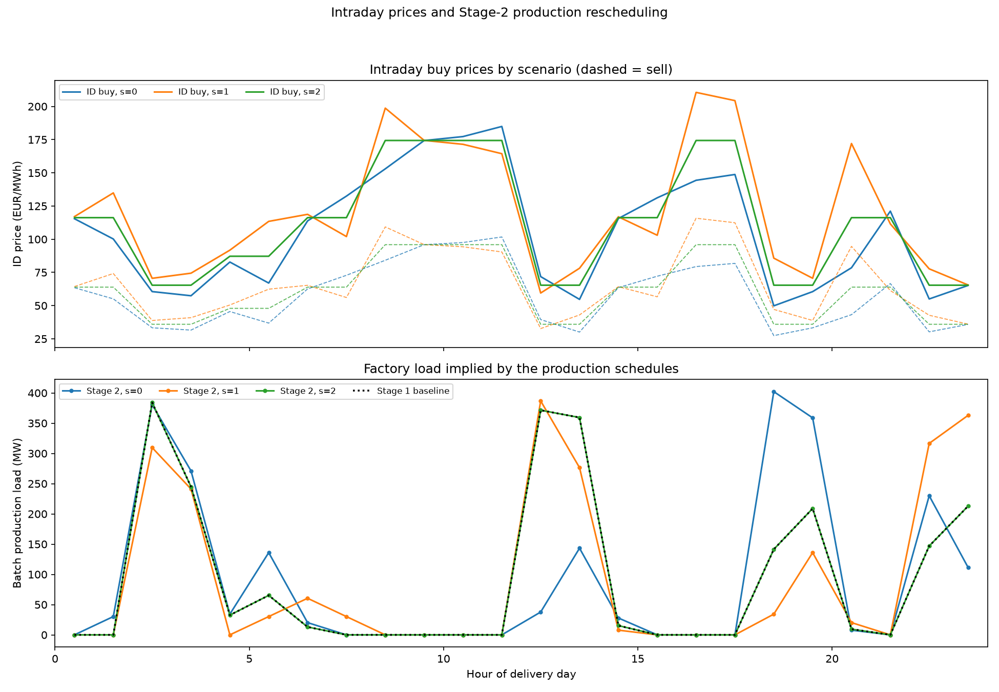
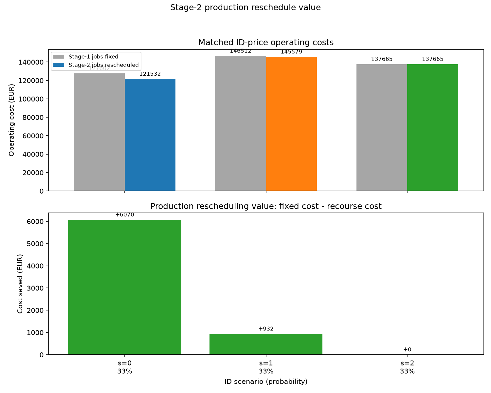
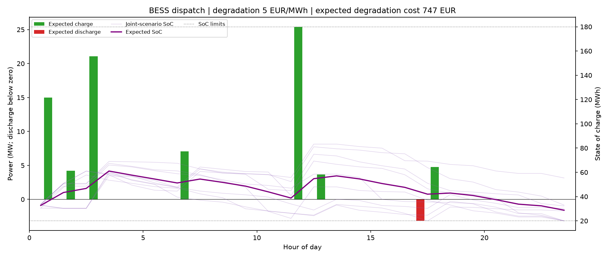
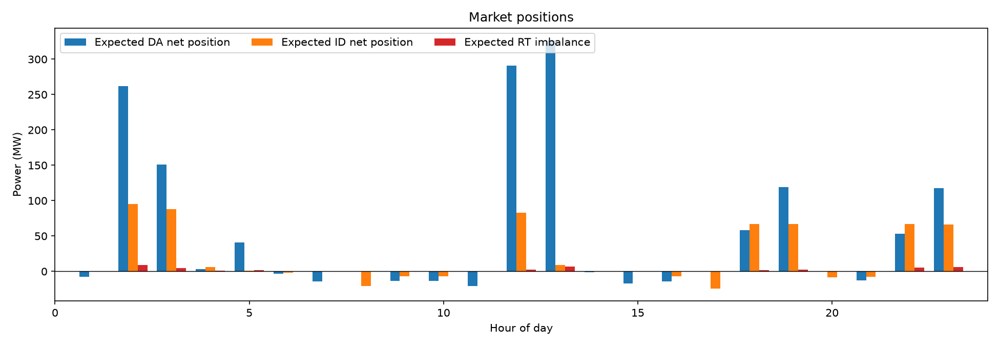

# Owner Report: Multistage Factory Market Scheduling

**Run:** 3 ID price scenarios × 3 RT scenarios; seed 2024; 24-hour horizon; 1% MIP-gap target; BESS degradation €5/MWh on throughput. **Status:** optimal termination with 0.986% reported gap; independent verification passed.

## Executive summary

The Stage 1 plan schedules **17 batches and 193 units**. The market-stage comparison estimates expected net operating cost of **€138,744** for DA-only plus RT imbalance settlement, **€137,712** after adding ID trading, and **€129,534** after adding the modelled up-reserve offer. On this scenario set, DA+ID+up-reserve is **€9,211 lower than DA-only**.

Separately, re-optimizing the production schedule against each ID price scenario saves a probability-weighted **€2,334** compared with keeping the Stage 1 jobs fixed, when both schedules are evaluated at the same ID prices and Stage 1 MT commitment. This is a separate rescheduling study; **it is not included in the €129,534 offering cost** and must not be added to that market-stage saving.

These are modeled energy/operating settlement costs, **not total factory profit or ROI**. Product-sales revenue, labor, and other non-energy business costs are not included.

## Market participation comparison

All three cases use the same 3×3 uncertainty tree. RT imbalance settlement remains active in each case; the first case removes ID trading and reserve offers, not the settlement of real-time deviations.

| Modeled participation | Expected net cost | Saving vs. DA-only |
|---|---:|---:|
| DA-only + RT imbalance settlement | €138,744.23 | — |
| DA + ID + RT imbalance settlement | €137,712.35 | €1,031.88 |
| DA + ID + RT settlement + modeled up-reserve | €129,533.65 | €9,210.58 |

The full offering run receives **€16,602.20** in modeled reserve-capacity and activation revenue combined. The total net-cost change is not equal to this gross reserve revenue because the model re-optimizes energy positions and operating decisions in each case.

Detailed data: [market_stage_comparison.csv](offering_owner_report_results/market_stage_comparison.csv) and [comparison.csv](offering_owner_report_results/comparison.csv).

## Intraday production rescheduling

The Stage 2 rescheduler creates one production plan per ID price scenario. It holds the Stage 1 MT commitment fixed; started jobs are frozen before the configured cutoff. At cutoff hour 0, all delivery-day jobs are still movable. The counterfactual fixes the Stage 1 jobs and re-optimizes dispatch under the same ID prices and commitment.

| ID scenario | Probability | Fixed-plan cost | Rescheduled cost | Cost saved | Jobs changed | Units |
|---|---:|---:|---:|---:|---:|---:|
| 0 | 33.3% | €127,602.00 | €121,532.19 | €6,069.81 | 13 | 193 |
| 1 | 33.3% | €146,511.78 | €145,579.48 | €932.30 | 13 | 192 |
| 2 | 33.3% | €137,665.27 | €137,665.27 | €0.00 | 0 | 193 |
| **Probability-weighted value** | **100%** |  |  | **€2,334.04** |  |  |

In scenario 2, the fixed Stage 1 plan was retained because it was already the least-cost feasible incumbent. The rescheduling savings are measured in a standalone ID-price scheduling solve; they are not yet fed back into the offering-profit objective, DA/ID bid schedule, or RT settlement results.

Detailed data: [intraday_reschedule_summary.csv](offering_owner_report_results/intraday_reschedule_summary.csv) and [intraday_rescheduled_jobs.csv](offering_owner_report_results/intraday_rescheduled_jobs.csv).

## Cost and operating drivers

| Expected item | Amount |
|---|---:|
| DA net settlement cost | €83,067.40 |
| ID net settlement cost | €29,439.00 |
| Reserve capacity revenue | −€12,071.82 |
| Reserve activation revenue | −€4,530.38 |
| RT imbalance cost | €3,860.31 |
| MT operating cost | €28,408.53 |
| BESS degradation cost | €747.45 |
| Demand-response activation cost | €613.16 |
| **Expected net cost** | **€129,533.65** |

The run offered an average **36.15 MW** of modeled upward reserve over 23 hours and had expected reserve activation of **70.99 MWh**. The BESS degradation rate was explicitly set to **€5/MWh throughput**. The summary reports 24 MT-on hours and one start.

## Assumptions and limitations

- Price, load, RT imbalance, and reserve-deployment paths were generated from the stated seeds; these are not live Nord Pool or Energinet observations.
- The objective excludes product-sales revenue, so expected net cost must not be called factory profit, total margin, or guaranteed savings.
- The 3×3 tree has only nine joint paths. The reported 95% CVaR is too sample-sensitive for a bankable tail-risk estimate; `beta=0` means CVaR did not affect this run’s objective.
- The Stage 2 production reschedule is a separate analysis, not an integrated production/market recourse optimization. Its €2,334 estimate is not additive to the €9,211 market-stage comparison.
- Reserve is a generic upward-reserve representation, not a compliant DK1/DK2 mFRR/FCR/aFRR bid. The model uses hourly scheduling and does not enforce Danish 0.1 MW continuous-ID execution, product gate closure, prequalification, or current Energinet requirements.
- The report on Danish markets warns that product rules change. Verify current Energinet rules, technical qualification, bid sizes, and settlement terms before submitting actual bids.

## Rerun

From this directory, use the exact owner-run command documented in [README.md](README.md#reproduce-the-owner-run). The output files used for this report are committed under `offering_owner_report_results/`.